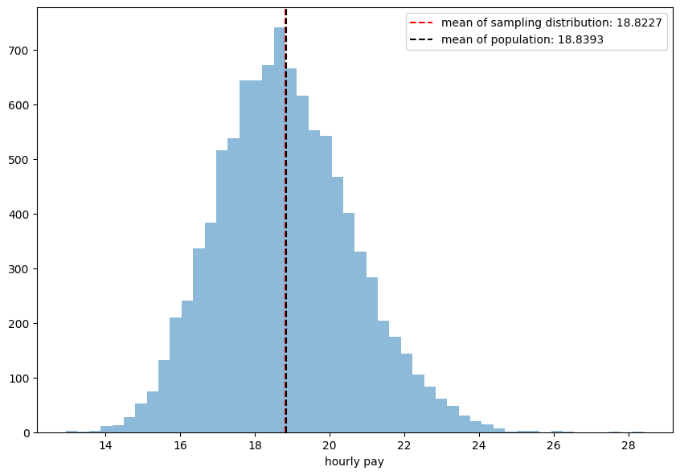

#### **CENTRAL LIMIT THEOREM**

Task: to show how Central Limit Theorm helps us estimate a population using a sample


```python
import pandas as pd
import numpy as np
import matplotlib.pyplot as plt 
import seaborn as sns
import random
import scipy.stats as st
```

**The population**

Our population consists of 3000000 entries of hourly wages. Later we will draw a sample from this population and show how we can make estimates about the population using that sample.


```python
hourly_pay = np.genfromtxt('hourly_pay')
```


```python
hourly_pay 
```


    array([ 6.63,  0.  , 14.34, ...,  1.6 ,  0.8 , 11.01])


```python
len(hourly_pay)
```


    3000000


```python
#plotting the population... to see how the data is...

plt.figure(figsize=(10.2,7), dpi=100)

plt.hist(hourly_pay, bins=50, alpha =0.5)
plt.axvline(hourly_pay.mean(), color='red', linestyle='dashed')
plt.xlabel("hourly pay")
plt.show()

print("mean salary :",hourly_pay.mean().round(2))
```


    mean salary : 18.84


**an example of sampling... just to demo how random sampling is done**


```python
array = list(np.linspace(1,10,10)) #generates an array of 10 equally spaced numbers between one and ten
```


```python
random.sample(array, 5)  #generates a sample of 5 digits from the array
```


    [7.0, 10.0, 8.0, 6.0, 1.0]


**1) Sampling distribution**

drawing a random sample of 150 hourly wages from the population of 3000000 hourly pays.


```python
population = list(hourly_pay) # saving the array as a list named population for easier use. 
```


```python
sample1 = random.sample(population, 150)
```

plotting sample1


```python
plt.figure(figsize=(10.2,7), dpi=100)

plt.hist(sample1, bins=50, alpha =0.5)   
plt.axvline(np.mean(sample1), color='red', linestyle ='dashed')
plt.xlabel("hourly pay")
plt.show()

print("mean salary :",np.mean(sample1).round(2))
```


    mean salary : 21.15


That was one sample, now we will draw 10,000 samples of size 100 each from the population and track their means


```python
samp_means = []

for i in range(10000):
    samp = random.sample(population, 100)   
    samp_means.append(np.mean(samp))        
```


```python
samp_means[0:5]
```


    [19.2038, 17.546300000000002, 17.751199999999997, 17.0573, 20.269199999999998]


Now lets plot a histogram of the sample means, and also compare the **mean of the sample means** with the **mean of the population**


```python
print("\nhistogram of sample means:\n")    

plt.figure(figsize=(10.2,7), dpi=100)
plt.hist(samp_means, bins=50, alpha =0.5)  
plt.axvline(np.mean(samp_means), color='red', linestyle='dashed',\
            label = f'mean of sampling distribution: {np.mean(samp_means).round(4)}')

plt.axvline(np.mean(population), color='black', linestyle='dashed',
           label = f'mean of population: {np.mean(population).round(4)}')   
                                          
plt.xlabel("hourly pay")
plt.legend()
plt.show()
```

    
    histogram of sample means:
    




It can be seen the mean of the sampling distribution (mean of the sample means) is equal to the mean of the population. **This is the essence of central limit theorm.**

Central limit theorm is not applicable for other statistics such as standard deviation, maximum, minimum etc. 

**2) Shape of the sampling distribution**

 **Proving that distribution of sample means is similar to a normal distribution with *population mean* for mean and *standard error* for standard deviation.**

This is proven here by showing that the shape of normal distribution with *population mean* for mean and *standard error* for standard deviation, and the shape of the distribution of sample means match exaclty.  

<div class="math-container">
$$\text{sampling distribution} \sim N(\text{population mean}, \text{standard error})$$

$$\text{standard error} = \frac{\text{population standard deviation}}{\text{square root of sample size}}
$$
</div>


```python
sample_size = 100
```

drawing 10,000 samples of size = sample_size from the population


```python
samp_means = []

for i in range(10000):
    samp = random.sample(population, sample_size)
    samp_means.append(np.mean(samp)) 
```


```python
#plotting the sample means
plt.figure(figsize=(10.2,7), dpi=100)
sns.distplot(samp_means, bins=50, label="distribution of sample means")

mu = np.mean(population)
std_error = np.std(population)/(np.sqrt(sample_size))

#normal distribution with mean = mu and standard deviation = standard error
x = np.linspace(mu-4*std_error, mu+4*std_error, 100)
plt.plot(x, st.norm.pdf(x, mu, std_error), color='black',label="normal distribution")

plt.legend()

plt.xlabel("hourly pay")
plt.xlim(0,40)

plt.show()
```


This means we can form inferences about the population mean and population standard deviation from mean and standard deviation of sampling distribution. 

**3) estimating population parameters from sample parameters**


```python
sample2 = random.sample(population, 100) #drawing a sample, which we will use to estimate
```

Using this one sample that we have, we can draw inferences about the sampling distribution, from which we can in turn make inferences about the population mean, and the population standard deviation.  


```python
mu = np.mean(sample2)
```


```python
standard_error_sample = np.std(sample2)/(np.sqrt(100)) 
```


```python
standard_error_sample
```


    1.750302669226097


```python
standard_error_population = np.std(population)/(np.sqrt(100)) 
```


```python
standard_error_population
```


    1.8101231471493076


standard error calculated from the sample and standard error calculated from the population are very close. So we can approximate the *population standard error* with *sample standard error*, since the sample is all we have in a real world situation. 


```python
sigma = standard_error_sample
```


```python
x = np.linspace(mu-4*sigma, mu+4*sigma, 100)    
```


```python

#plotting the sample means, which we cannot do in real becasue we cannot draw multiple samples for our work. we just have one sample to work with. shown here for comparison

plt.figure(figsize=(10.2,7), dpi=100)
sns.distplot(samp_means, bins=50, label="sampling distribution")

plt.plot(x, st.norm.pdf(x, mu, sigma), color='black', label="normal distribution with sample parameters")

plt.xlabel("hourly pay")
plt.xlim(0,40)

plt.legend()

plt.show()
```


The sampling distribution is plotted here for comparison purposes. In real world situation we would have just one sample, not a sampling distribution. 

The normal curve with sample parameters is the best approximation of population that we can get. **Notice how the width of both distributions are almost similar. We can use it to make estimates about the population mean.**

**The estimate**


```python
upper_ci = st.norm.ppf(0.975, mu, sigma) # upper confidence interval
lower_ci = st.norm.ppf(0.025, mu, sigma) # lower confidence interval

print(f"we can say with 95% confidence that the population mean\
 {np.mean(population).round(2)} is between {upper_ci.round(2)} and {lower_ci.round(2)}")
```

    we can say with 95% confidence that the population mean 18.84 is between 23.43 and 16.57

