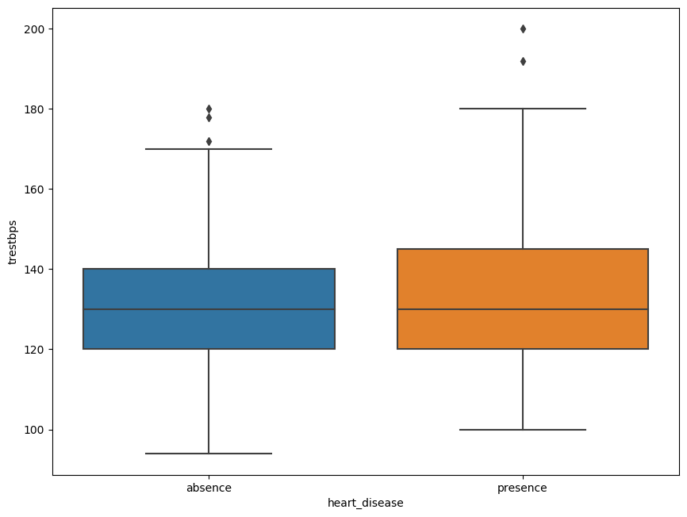
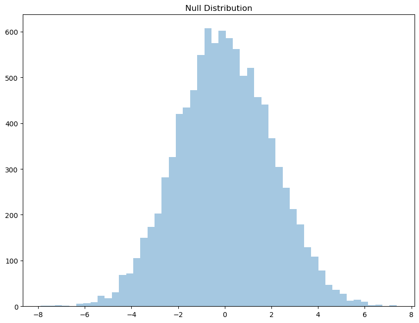
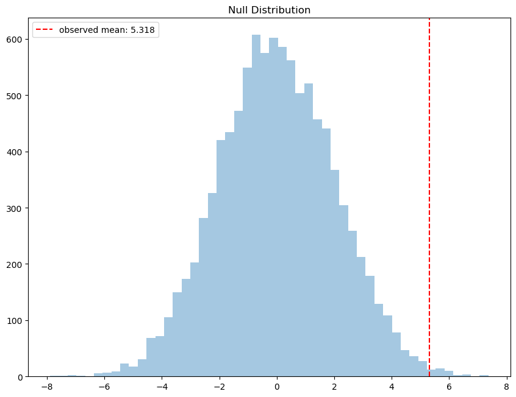
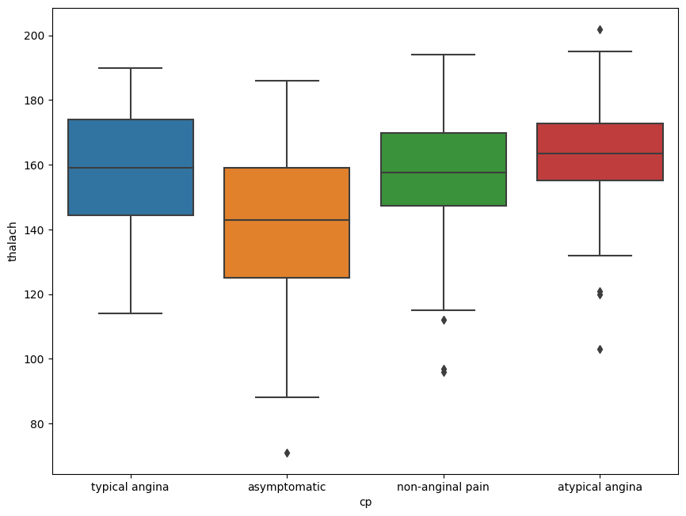
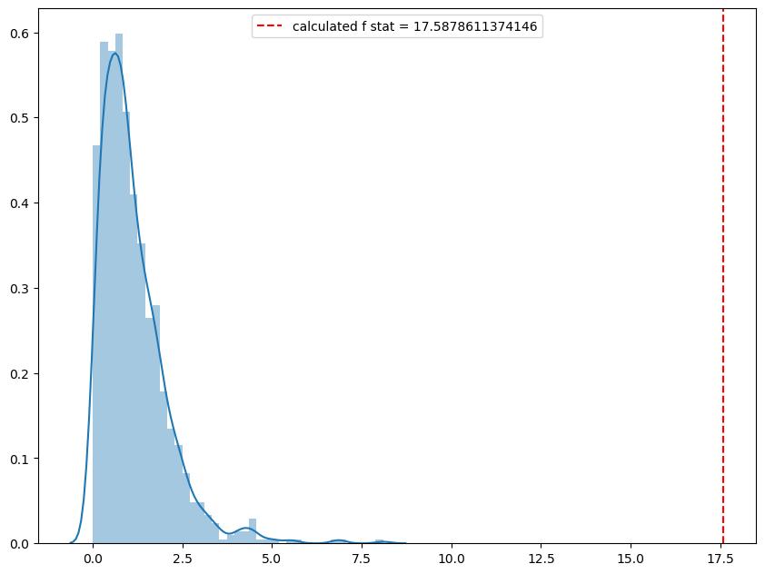
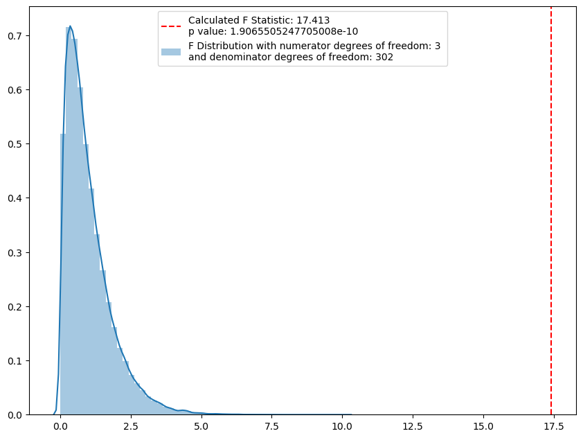
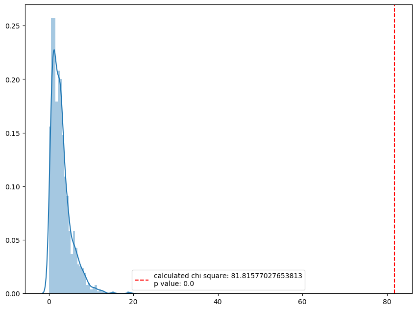
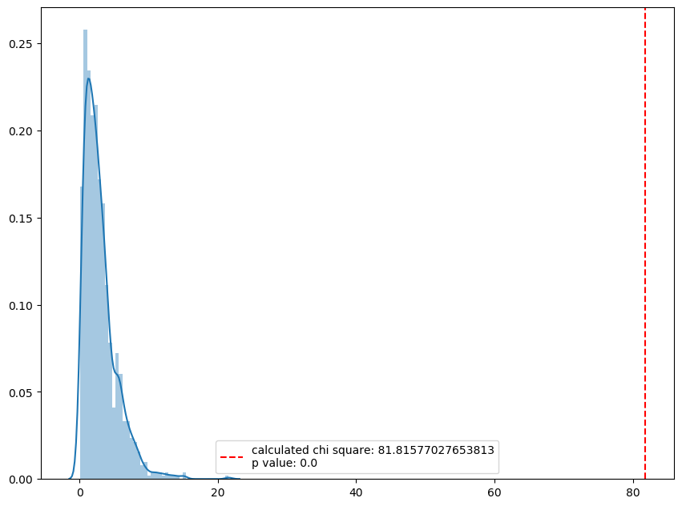

#### **Hypothesis Testing for association**


```python
import pandas as pd
import numpy as np
%matplotlib inline
import matplotlib.pyplot as plt 
import seaborn as sns
import scipy.stats as st
```


```python
import random
random.seed(122)
```

**The dataset contains information on patients who were screened for heart disease. We are trying to understand what variables are most predictive of getting diagnosed with heart diesease.**

The data was downloaded from the [UCI Machine Learning Repository](https://archive.ics.uci.edu/ml/datasets/Heart+Disease) and then cleaned for analysis. The principal investigators responsible for data collection were:

1. Hungarian Institute of Cardiology. Budapest: Andras Janosi, M.D.
2. University Hospital, Zurich, Switzerland: William Steinbrunn, M.D.
3. University Hospital, Basel, Switzerland: Matthias Pfisterer, M.D.
4. V.A. Medical Center, Long Beach and Cleveland Clinic Foundation: Robert Detrano, M.D., Ph.D.

**Skip to test of interest**

**[two sample t test](#1)**

**[anova](#2)**

**[chi squared test](#3)**


```python
heart = pd.read_csv('heart_disease.csv')
heart.head()
```


<pre>
<div>
<style scoped>
    .dataframe tbody tr th:only-of-type {
        vertical-align: middle;
    }

    .dataframe tbody tr th {
        vertical-align: top;
    }

    .dataframe thead th {
        text-align: right;
    }
</style>
<table border="1" class="dataframe">
  <thead>
    <tr style="text-align: right;">
      <th></th>
      <th>age</th>
      <th>sex</th>
      <th>trestbps</th>
      <th>chol</th>
      <th>cp</th>
      <th>exang</th>
      <th>fbs</th>
      <th>thalach</th>
      <th>heart_disease</th>
    </tr>
  </thead>
  <tbody>
    <tr>
      <th>0</th>
      <td>63.0</td>
      <td>male</td>
      <td>145.0</td>
      <td>233.0</td>
      <td>typical angina</td>
      <td>0.0</td>
      <td>1.0</td>
      <td>150.0</td>
      <td>absence</td>
    </tr>
    <tr>
      <th>1</th>
      <td>67.0</td>
      <td>male</td>
      <td>160.0</td>
      <td>286.0</td>
      <td>asymptomatic</td>
      <td>1.0</td>
      <td>0.0</td>
      <td>108.0</td>
      <td>presence</td>
    </tr>
    <tr>
      <th>2</th>
      <td>67.0</td>
      <td>male</td>
      <td>120.0</td>
      <td>229.0</td>
      <td>asymptomatic</td>
      <td>1.0</td>
      <td>0.0</td>
      <td>129.0</td>
      <td>presence</td>
    </tr>
    <tr>
      <th>3</th>
      <td>37.0</td>
      <td>male</td>
      <td>130.0</td>
      <td>250.0</td>
      <td>non-anginal pain</td>
      <td>0.0</td>
      <td>0.0</td>
      <td>187.0</td>
      <td>absence</td>
    </tr>
    <tr>
      <th>4</th>
      <td>41.0</td>
      <td>female</td>
      <td>130.0</td>
      <td>204.0</td>
      <td>atypical angina</td>
      <td>0.0</td>
      <td>0.0</td>
      <td>172.0</td>
      <td>absence</td>
    </tr>
  </tbody>
</table>
</div>
</pre>


```python
len(heart)
```


    303


```python
heart.describe(include='all')
```


<pre>
<div>
<style scoped>
    .dataframe tbody tr th:only-of-type {
        vertical-align: middle;
    }

    .dataframe tbody tr th {
        vertical-align: top;
    }

    .dataframe thead th {
        text-align: right;
    }
</style>
<table border="1" class="dataframe">
  <thead>
    <tr style="text-align: right;">
      <th></th>
      <th>age</th>
      <th>sex</th>
      <th>trestbps</th>
      <th>chol</th>
      <th>cp</th>
      <th>exang</th>
      <th>fbs</th>
      <th>thalach</th>
      <th>heart_disease</th>
    </tr>
  </thead>
  <tbody>
    <tr>
      <th>count</th>
      <td>303.000000</td>
      <td>303</td>
      <td>303.000000</td>
      <td>303.000000</td>
      <td>303</td>
      <td>303.000000</td>
      <td>303.000000</td>
      <td>303.000000</td>
      <td>303</td>
    </tr>
    <tr>
      <th>unique</th>
      <td>NaN</td>
      <td>2</td>
      <td>NaN</td>
      <td>NaN</td>
      <td>4</td>
      <td>NaN</td>
      <td>NaN</td>
      <td>NaN</td>
      <td>2</td>
    </tr>
    <tr>
      <th>top</th>
      <td>NaN</td>
      <td>male</td>
      <td>NaN</td>
      <td>NaN</td>
      <td>asymptomatic</td>
      <td>NaN</td>
      <td>NaN</td>
      <td>NaN</td>
      <td>absence</td>
    </tr>
    <tr>
      <th>freq</th>
      <td>NaN</td>
      <td>206</td>
      <td>NaN</td>
      <td>NaN</td>
      <td>144</td>
      <td>NaN</td>
      <td>NaN</td>
      <td>NaN</td>
      <td>164</td>
    </tr>
    <tr>
      <th>mean</th>
      <td>54.438944</td>
      <td>NaN</td>
      <td>131.689769</td>
      <td>246.693069</td>
      <td>NaN</td>
      <td>0.326733</td>
      <td>0.148515</td>
      <td>149.607261</td>
      <td>NaN</td>
    </tr>
    <tr>
      <th>std</th>
      <td>9.038662</td>
      <td>NaN</td>
      <td>17.599748</td>
      <td>51.776918</td>
      <td>NaN</td>
      <td>0.469794</td>
      <td>0.356198</td>
      <td>22.875003</td>
      <td>NaN</td>
    </tr>
    <tr>
      <th>min</th>
      <td>29.000000</td>
      <td>NaN</td>
      <td>94.000000</td>
      <td>126.000000</td>
      <td>NaN</td>
      <td>0.000000</td>
      <td>0.000000</td>
      <td>71.000000</td>
      <td>NaN</td>
    </tr>
    <tr>
      <th>25%</th>
      <td>48.000000</td>
      <td>NaN</td>
      <td>120.000000</td>
      <td>211.000000</td>
      <td>NaN</td>
      <td>0.000000</td>
      <td>0.000000</td>
      <td>133.500000</td>
      <td>NaN</td>
    </tr>
    <tr>
      <th>50%</th>
      <td>56.000000</td>
      <td>NaN</td>
      <td>130.000000</td>
      <td>241.000000</td>
      <td>NaN</td>
      <td>0.000000</td>
      <td>0.000000</td>
      <td>153.000000</td>
      <td>NaN</td>
    </tr>
    <tr>
      <th>75%</th>
      <td>61.000000</td>
      <td>NaN</td>
      <td>140.000000</td>
      <td>275.000000</td>
      <td>NaN</td>
      <td>1.000000</td>
      <td>0.000000</td>
      <td>166.000000</td>
      <td>NaN</td>
    </tr>
    <tr>
      <th>max</th>
      <td>77.000000</td>
      <td>NaN</td>
      <td>200.000000</td>
      <td>564.000000</td>
      <td>NaN</td>
      <td>1.000000</td>
      <td>1.000000</td>
      <td>202.000000</td>
      <td>NaN</td>
    </tr>
  </tbody>
</table>
</div>
</pre>


```python
heart.info()
```

    <class 'pandas.core.frame.DataFrame'>
    RangeIndex: 303 entries, 0 to 302
    Data columns (total 9 columns):
     #   Column         Non-Null Count  Dtype  
    ---  ------         --------------  -----  
     0   age            303 non-null    float64
     1   sex            303 non-null    object 
     2   trestbps       303 non-null    float64
     3   chol           303 non-null    float64
     4   cp             303 non-null    object 
     5   exang          303 non-null    float64
     6   fbs            303 non-null    float64
     7   thalach        303 non-null    float64
     8   heart_disease  303 non-null    object 
    dtypes: float64(6), object(3)
    memory usage: 21.4+ KB


```python
heart.groupby('heart_disease').mean().round(2)
```


<pre>
<div>
<style scoped>
    .dataframe tbody tr th:only-of-type {
        vertical-align: middle;
    }

    .dataframe tbody tr th {
        vertical-align: top;
    }

    .dataframe thead th {
        text-align: right;
    }
</style>
<table border="1" class="dataframe">
  <thead>
    <tr style="text-align: right;">
      <th></th>
      <th>age</th>
      <th>trestbps</th>
      <th>chol</th>
      <th>exang</th>
      <th>fbs</th>
      <th>thalach</th>
    </tr>
    <tr>
      <th>heart_disease</th>
      <th></th>
      <th></th>
      <th></th>
      <th></th>
      <th></th>
      <th></th>
    </tr>
  </thead>
  <tbody>
    <tr>
      <th>absence</th>
      <td>52.59</td>
      <td>129.25</td>
      <td>242.64</td>
      <td>0.14</td>
      <td>0.14</td>
      <td>158.38</td>
    </tr>
    <tr>
      <th>presence</th>
      <td>56.63</td>
      <td>134.57</td>
      <td>251.47</td>
      <td>0.55</td>
      <td>0.16</td>
      <td>139.26</td>
    </tr>
  </tbody>
</table>
</div>
</pre>


```python
heart.groupby('heart_disease').median()
```


<pre>
<div>
<style scoped>
    .dataframe tbody tr th:only-of-type {
        vertical-align: middle;
    }

    .dataframe tbody tr th {
        vertical-align: top;
    }

    .dataframe thead th {
        text-align: right;
    }
</style>
<table border="1" class="dataframe">
  <thead>
    <tr style="text-align: right;">
      <th></th>
      <th>age</th>
      <th>trestbps</th>
      <th>chol</th>
      <th>exang</th>
      <th>fbs</th>
      <th>thalach</th>
    </tr>
    <tr>
      <th>heart_disease</th>
      <th></th>
      <th></th>
      <th></th>
      <th></th>
      <th></th>
      <th></th>
    </tr>
  </thead>
  <tbody>
    <tr>
      <th>absence</th>
      <td>52.0</td>
      <td>130.0</td>
      <td>234.5</td>
      <td>0.0</td>
      <td>0.0</td>
      <td>161.0</td>
    </tr>
    <tr>
      <th>presence</th>
      <td>58.0</td>
      <td>130.0</td>
      <td>249.0</td>
      <td>1.0</td>
      <td>0.0</td>
      <td>142.0</td>
    </tr>
  </tbody>
</table>
</div>
</pre>


```python
heart.groupby('heart_disease')['trestbps'].mean().round(2)
```


    heart_disease
    absence     129.25
    presence    134.57
    Name: trestbps, dtype: float64


```python
plt.figure(figsize=(10.2,7.8), dpi=100)
sns.boxplot(y='trestbps',x = 'heart_disease', data = heart)
plt.show()
```




What we investigate here is whether the difference in the means of 'trestbps' among people diagnosed with heart disease or not is due to randomness of the data, or if the difference holds in all conditions.

<a id=1></a>
**Two sample t-test**

$$H_{0}$$: There is no difference in mean resting bp among individuals with heart disease and no heart disease. 

(Another way of saying this is: true mean resting bp of people with heart disease minus the mean resting bp of people without heart disease is zero)

$$H_{1}$$: There is significant difference in mean resting bp among individuals with heart disease and without heart disease

---
For the simulation, we need to **break the 'possible association' between 'trestbps' and 'heart_disease'** first. For that, something we can do is reorder the 'heart_disease' column. (i.e. mix up 'presence' and 'absence'). 

And then based on this scrambled column, we assign resting blood pressures. And then find the mean difference between the patients with or without heart disease. This would become our simulated dataset. 

We draw many such samples using a 'for' loop.


```python
null_mean_diff = []

for i in range(10000):
    # randomnly reorder the heart disease column
    scramble = np.random.choice(heart.heart_disease, len(heart), replace=False)
    
    # assign true resting bps according to their indices in the original dataset, 
    # to the new scrambled dataset. 
    
    simulated_hd_yes = heart['trestbps'][scramble == 'presence']
    simulated_hd_no = heart['trestbps'][scramble == 'absence']
    # This breaks any possible association that was present in 
    # the original dataset. bps associated with presence of heart diesease might 
    # be associated with absence of heart disease in the new dataset, and otherwise.
    
    # calculate mean difference of bps of people with presence and absence of heart diesease
    # from the simulated dataset. 
    simulated_mean_diff = np.mean(simulated_hd_yes) - np.mean(simulated_hd_no)
    
    # save the mean difference in a list
    null_mean_diff.append(simulated_mean_diff)
    
    
# plot the simulated mean differences    
plt.figure(figsize=(10.2,7.8), dpi=100)
sns.distplot(null_mean_diff, kde=False)
plt.title("Null Distribution")
plt.show()
```




now we will look at the observed mean differences


```python
heart.groupby('heart_disease')['trestbps'].mean()
```


    heart_disease
    absence     129.250000
    presence    134.568345
    Name: trestbps, dtype: float64


```python
obsd_mean = heart.groupby('heart_disease')['trestbps'].mean()[1] - heart.groupby('heart_disease')['trestbps'].mean()[0]
```


```python
obsd_mean
```


    5.318345323740999


now we can see where this observed mean stand in the null distribution


```python
plt.figure(figsize=(10.2,7.8), dpi=100)
sns.distplot(null_mean_diff, kde=False)
plt.axvline(obsd_mean, color='red', linestyle='dashed', label= f"observed mean: {obsd_mean.round(3)}")
plt.title("Null Distribution")
plt.legend()
plt.show()
```




we can see how many of the null means are actually above the observed mean, and the probability of observing such values under null. (i.e. dividing by the number of times we simulated)


```python
p_value = (np.sum(null_mean_diff > obsd_mean)/10000)*2
```


```python
p_value
```


    0.0076


if the p value is less than the chosen significance level, then we can reject the $$H_{0}$$ in favor of $$H_{1}$$

**testing with the t-test in Scipy**


```python
g= heart.groupby('heart_disease')

st.ttest_ind(g.get_group('presence')['trestbps'], g.get_group('absence')['trestbps'])
```


    Ttest_indResult(statistic=2.647004396805282, pvalue=0.008548268928594928)


**there might be minor differences in p_value of t-statistic from the function within scipy and the simulated one, but thats because of the limited number of times we can run the simulations. If we could run them infinitely, we would get the values returned by the built in function**


**Why t-test?**


Its called a t-test, because it uses students t-distribution, which is very similar to normal distribution, but slightly squished, with thicker tails than normal dist. the thicker tails slightly overestimates the p-values which protects us from errors. that is why we use student t distribution for hypothesis testing. 

<a id=2></a>

### **anova**

<a id=22></a>


```python
plt.figure(figsize=(10.2,7.8), dpi=100)
sns.boxplot(y='thalach', x='cp', data=heart)
plt.show()
```




**to test: whether 'thalach', the achieved heart rate, varies significantly between people with various chest pains, 'cp'**

we need to see if there is significant variation between the various pairs. 

The test statistic is F-statistic and compares the mean square between samples to the mean square within sample.

We have one factor: 'cp'. There are four categories of the factor. 

Here i am going to manually find the mean square between samples and mean square within sample (according to the formula) and calculate the F statistic.


```python
g = heart.groupby('cp')


ls = []
for cp in g.groups.keys():
    x = np.sum(np.square((g.get_group(cp)['thalach'] - np.mean(g.get_group(cp)['thalach']))))
    ls.append(x)

#denominator degrees of freedom    
dfd = (len(heart)-1)

mean_sq_within = np.sum(ls)/dfd

mean_sq_within
```


    445.4410526200271


```python
between = heart.groupby('cp')['thalach'].describe()
between
```


<pre>
<div>
<style scoped>
    .dataframe tbody tr th:only-of-type {
        vertical-align: middle;
    }

    .dataframe tbody tr th {
        vertical-align: top;
    }

    .dataframe thead th {
        text-align: right;
    }
</style>
<table border="1" class="dataframe">
  <thead>
    <tr style="text-align: right;">
      <th></th>
      <th>count</th>
      <th>mean</th>
      <th>std</th>
      <th>min</th>
      <th>25%</th>
      <th>50%</th>
      <th>75%</th>
      <th>max</th>
    </tr>
    <tr>
      <th>cp</th>
      <th></th>
      <th></th>
      <th></th>
      <th></th>
      <th></th>
      <th></th>
      <th></th>
      <th></th>
    </tr>
  </thead>
  <tbody>
    <tr>
      <th>asymptomatic</th>
      <td>144.0</td>
      <td>140.680556</td>
      <td>22.982101</td>
      <td>71.0</td>
      <td>125.00</td>
      <td>143.0</td>
      <td>159.00</td>
      <td>186.0</td>
    </tr>
    <tr>
      <th>atypical angina</th>
      <td>50.0</td>
      <td>162.420000</td>
      <td>18.988815</td>
      <td>103.0</td>
      <td>155.25</td>
      <td>163.5</td>
      <td>172.75</td>
      <td>202.0</td>
    </tr>
    <tr>
      <th>non-anginal pain</th>
      <td>86.0</td>
      <td>155.406977</td>
      <td>19.316788</td>
      <td>96.0</td>
      <td>147.25</td>
      <td>157.5</td>
      <td>169.75</td>
      <td>194.0</td>
    </tr>
    <tr>
      <th>typical angina</th>
      <td>23.0</td>
      <td>155.956522</td>
      <td>20.899061</td>
      <td>114.0</td>
      <td>144.50</td>
      <td>159.0</td>
      <td>174.00</td>
      <td>190.0</td>
    </tr>
  </tbody>
</table>
</div>
</pre>


```python
ls = []
for i in range(len(between)):
    x = np.square(between.iloc[i,1] - np.mean(heart['thalach'])) * between.iloc[i,0]
    ls.append(x)

#numerator degrees of freedom  
dfn = (len(between)-1)

mean_sq_between = np.sum(ls)/dfn

mean_sq_between
```


    7834.355378384826


```python
calc_f_stat = mean_sq_between/mean_sq_within

calc_f_stat
```


    17.5878611374146


this is f statistic that we calculate manually

now to demo that the ratio indeed follows an f-distribution under null (i.e. no association between variables) we can scramble the data (so as to break any association if there is), get many such values and plot it

<br>
**detour:** explaining the need for random choice 'without replacement'


```python
scrambled = np.random.choice(heart.cp, len(heart), replace=True)
scrambled = pd.DataFrame(scrambled)
scrambled.rename({0:'cp'}, axis=1, inplace=True)

print("\n from orginal\n")
print(heart['cp'].value_counts())
print("\n from scrambled\n")
print(scrambled['cp'].value_counts())
```

    
     from orginal
    
    asymptomatic        144
    non-anginal pain     86
    atypical angina      50
    typical angina       23
    Name: cp, dtype: int64
    
     from scrambled
    
    asymptomatic        144
    non-anginal pain     93
    atypical angina      46
    typical angina       20
    Name: cp, dtype: int64


when we generate random values with replacement, the value counts in 'scrambled' differ each time. We actually want the value counts to be the same everytime. Hence we use random choice without replacement. 
<br>

**simulating f-distribution: we scramble the data like before, and plot the distribution**


```python
f_stats = []

for i in range(1000):
    #scrambling....
    scrambled = np.random.choice(heart.cp, len(heart), replace=False)
    scrambled = pd.DataFrame(scrambled)
    scrambled.rename({0:'cp'}, axis=1, inplace=True)
    heart_ = pd.concat([scrambled, heart.thalach], axis=1, join='inner')
    
    #mean square within
    ls = []
    for cp in g.groups.keys():
        x = np.sum(np.square((g.get_group(cp)['thalach'] - np.mean(g.get_group(cp)['thalach']))))
        ls.append(x)
    dfd = (len(heart_)-1)
    mean_sq_within = np.sum(ls)/dfd
    
    #mean square between
    between = heart_.groupby('cp')['thalach'].describe()
    ls = []
    for i in range(len(between)):
        x = np.square(between.iloc[i,1] - np.mean(heart_['thalach'])) * between.iloc[i,0]
        ls.append(x)
    dfn = (len(between)-1)
    
    mean_sq_between = np.sum(ls)/dfn
    
    #f statistic
    f_stat = mean_sq_between/mean_sq_within
    
    #appending the f_statistic to list of such  statistics
    f_stats.append(f_stat)
```


```python
plt.figure(figsize=(10.2,7.8), dpi = 100)
sns.distplot(f_stats,kde=True) 
plt.axvline(calc_f_stat, color='red', linestyle='dashed',\
            label=f"calculated f stat = {calc_f_stat}")
plt.legend()
plt.show()
p_value = 1 - ((np.sum(f_stats<calc_f_stat))/len(f_stats))
print(f"p value: {p_value.round(3)}")
```



    p value: 0.0


**trying to recreate the same plot using scipy's inbuilt f statistic generator.**


```python
plt.figure(figsize=(10.2,7.8), dpi = 100)

sns.distplot(st.f.rvs(dfn, dfd, size=100000), kde=True,\
label= f'F Distribution with numerator degrees of freedom: {dfn} \nand denominator degrees of freedom: {dfd}')

# calculating the f statistic for the groups using the function
calc_f_stat, p_value = \
            st.f_oneway(g.get_group('asymptomatic')['thalach'],\
            g.get_group('atypical angina')['thalach'],\
            g.get_group('non-anginal pain')['thalach'],\
            g.get_group('typical angina')['thalach'])

plt.axvline(calc_f_stat, color='red', linestyle='dashed',\
            label = f'Calculated F Statistic: {calc_f_stat.round(3)}\np value: {p_value}')
plt.legend()
plt.show()
```




**as can be seen the f-distribution is the very close to the distribution of ratios that we calculated manualy.**

**both of these (simulated test and the in built test) tell us that 'thalach the achieved heart rate, varies significantly between people with various chest pains 'cp'**

**now inorder to check where the difference lies...**


**HSD is the least amount that means must vary from each other inorder to be significantly different.**

the formula for HSD = q * sqrt(mean_sq_within/n), where (q is a constant from 'studentised range q table', n is the number in each category)


```python
from statsmodels.stats.multicomp import pairwise_tukeyhsd
output = pairwise_tukeyhsd(heart.thalach, heart.cp)
print(output)
```

               Multiple Comparison of Means - Tukey HSD, FWER=0.05           
    =========================================================================
         group1           group2      meandiff p-adj   lower    upper  reject
    -------------------------------------------------------------------------
        asymptomatic  atypical angina  21.7394  0.001  12.7439  30.735   True
        asymptomatic non-anginal pain  14.7264  0.001    7.258 22.1948   True
        asymptomatic   typical angina   15.276 0.0081   2.9702 27.5817   True
     atypical angina non-anginal pain   -7.013 0.2481 -16.7591   2.733  False
     atypical angina   typical angina  -6.4635 0.6069 -20.2707  7.3438  False
    non-anginal pain   typical angina   0.5495    0.9  -12.315 13.4141  False
    -------------------------------------------------------------------------


**We see that there is significant difference between the asymptomatic groups w.r.t. every other group. as can be seen [here](#22)** 

---

<a id=3></a>


### **Chi Square distribution** 

used to check if there is an association between categorical variables

**checking whether there is association between people with heart disease and the kind of chest pain that they have, using the built in function form scipy**


```python
obs = pd.crosstab(heart.heart_disease, heart.cp)
obs
```


<pre>
<div>
<style scoped>
    .dataframe tbody tr th:only-of-type {
        vertical-align: middle;
    }

    .dataframe tbody tr th {
        vertical-align: top;
    }

    .dataframe thead th {
        text-align: right;
    }
</style>
<table border="1" class="dataframe">
  <thead>
    <tr style="text-align: right;">
      <th>cp</th>
      <th>asymptomatic</th>
      <th>atypical angina</th>
      <th>non-anginal pain</th>
      <th>typical angina</th>
    </tr>
    <tr>
      <th>heart_disease</th>
      <th></th>
      <th></th>
      <th></th>
      <th></th>
    </tr>
  </thead>
  <tbody>
    <tr>
      <th>absence</th>
      <td>39</td>
      <td>41</td>
      <td>68</td>
      <td>16</td>
    </tr>
    <tr>
      <th>presence</th>
      <td>105</td>
      <td>9</td>
      <td>18</td>
      <td>7</td>
    </tr>
  </tbody>
</table>
</div>
</pre>


```python
chi2, pval, dof, exp = st.chi2_contingency(obs)
print(f'chi-square statistic: {chi2}')
print(f'p-value for chi-square test: {pval.round(3)} ({pval})')
print(f'\nthe expected values are:\n {exp}')
```

    chi-square statistic: 81.81577027653815
    p-value for chi-square test: 0.0 (1.2517106007837527e-17)
    
    the expected values are:
     [[77.94059406 27.06270627 46.54785479 12.44884488]
     [66.05940594 22.93729373 39.45214521 10.55115512]]


**now to calculate the expected values and chi square manually**


```python
obs['row_total'] = obs.aggregate(np.sum, axis=1)
obs.loc['col_total'] = obs.aggregate(np.sum, axis=0)
```


```python
obs
```


<pre>
<div>
<style scoped>
    .dataframe tbody tr th:only-of-type {
        vertical-align: middle;
    }

    .dataframe tbody tr th {
        vertical-align: top;
    }

    .dataframe thead th {
        text-align: right;
    }
</style>
<table border="1" class="dataframe">
  <thead>
    <tr style="text-align: right;">
      <th>cp</th>
      <th>asymptomatic</th>
      <th>atypical angina</th>
      <th>non-anginal pain</th>
      <th>typical angina</th>
      <th>row_total</th>
    </tr>
    <tr>
      <th>heart_disease</th>
      <th></th>
      <th></th>
      <th></th>
      <th></th>
      <th></th>
    </tr>
  </thead>
  <tbody>
    <tr>
      <th>absence</th>
      <td>39</td>
      <td>41</td>
      <td>68</td>
      <td>16</td>
      <td>164</td>
    </tr>
    <tr>
      <th>presence</th>
      <td>105</td>
      <td>9</td>
      <td>18</td>
      <td>7</td>
      <td>139</td>
    </tr>
    <tr>
      <th>col_total</th>
      <td>144</td>
      <td>50</td>
      <td>86</td>
      <td>23</td>
      <td>303</td>
    </tr>
  </tbody>
</table>
</div>
</pre>


```python
exp = pd.DataFrame(columns=obs.columns, index=obs.index)
```


```python
for i in range(3):
    for j in range(5):
        exp.iloc[i,j] = (obs.iloc[i,4]*obs.iloc[2,j])/obs.iloc[2,4]
```


```python
exp
```


<pre>
<div>
<style scoped>
    .dataframe tbody tr th:only-of-type {
        vertical-align: middle;
    }

    .dataframe tbody tr th {
        vertical-align: top;
    }

    .dataframe thead th {
        text-align: right;
    }
</style>
<table border="1" class="dataframe">
  <thead>
    <tr style="text-align: right;">
      <th>cp</th>
      <th>asymptomatic</th>
      <th>atypical angina</th>
      <th>non-anginal pain</th>
      <th>typical angina</th>
      <th>row_total</th>
    </tr>
    <tr>
      <th>heart_disease</th>
      <th></th>
      <th></th>
      <th></th>
      <th></th>
      <th></th>
    </tr>
  </thead>
  <tbody>
    <tr>
      <th>absence</th>
      <td>77.9406</td>
      <td>27.0627</td>
      <td>46.5479</td>
      <td>12.4488</td>
      <td>164</td>
    </tr>
    <tr>
      <th>presence</th>
      <td>66.0594</td>
      <td>22.9373</td>
      <td>39.4521</td>
      <td>10.5512</td>
      <td>139</td>
    </tr>
    <tr>
      <th>col_total</th>
      <td>144</td>
      <td>50</td>
      <td>86</td>
      <td>23</td>
      <td>303</td>
    </tr>
  </tbody>
</table>
</div>
</pre>


```python
cal_chi_square = ((obs - exp)**2/exp).sum(axis=1).sum(axis=0)
```


```python
cal_chi_square
```


    81.81577027653813


this is the same as what the function returned
    
**now, to simulate, as before we scramble up the observed data (in-order to break the association between variables), and get chi_square values for each of such dataframes.**

Note: expected values for each of the scrambled data will be the same as what we have already seen. no point in generating expected values each time. 


```python
chi_sqs_null = []

for i in range(1000):
    scrambled_hd = np.random.choice(heart.heart_disease,\
                                    len(heart.heart_disease), replace=False)
    scrambled_cp = np.random.choice(heart.cp, len(heart.cp), replace=False)
    obs = pd.crosstab(scrambled_hd,scrambled_cp, margins=True)
    chi_square = ((obs - exp)**2/exp).sum(axis=1).sum(axis=0)
    chi_sqs_null.append(chi_square)
```


```python
plt.figure(figsize=(10.2,7.8), dpi = 100)
sns.distplot(chi_sqs_null)
p_value = 1- (np.sum(chi_sqs_null<cal_chi_square)/len(chi_sqs_null))
plt.axvline(cal_chi_square, color='red', linestyle='dashed',\
            label=f"calculated chi square: {cal_chi_square}\np value: {p_value}")
plt.legend()
plt.show()
```




comparing this with distribution of random chi squares with degree of freedom = 3 (1-number of rows)*(1-number of columns). We can see that both distributions look similar


```python
plt.figure(figsize=(10.2,7.8), dpi = 100)
sns.distplot(np.random.chisquare(3, size=1000))
p_value = 1- st.chi.cdf(cal_chi_square, df=3)
plt.axvline(cal_chi_square, color='red', linestyle='dashed',\
            label=f"calculated chi square: {cal_chi_square}\np value: {p_value}")
plt.legend()
plt.show()
```




**the p value tells us that there is significant association between people with heart disease and the kind of chest pain that they have... an association that cannot be owed to randomness of our specific data**


```python

```
