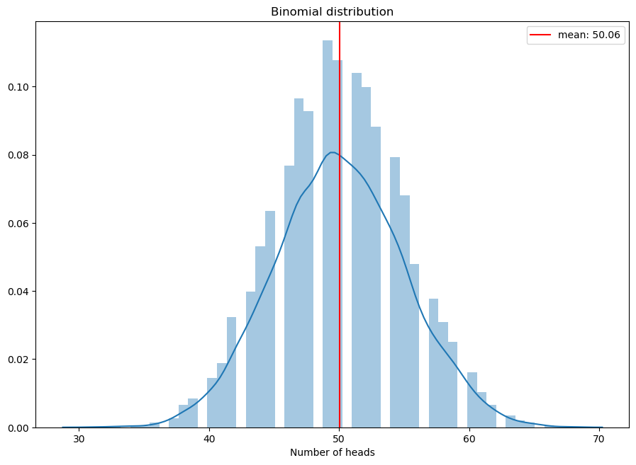
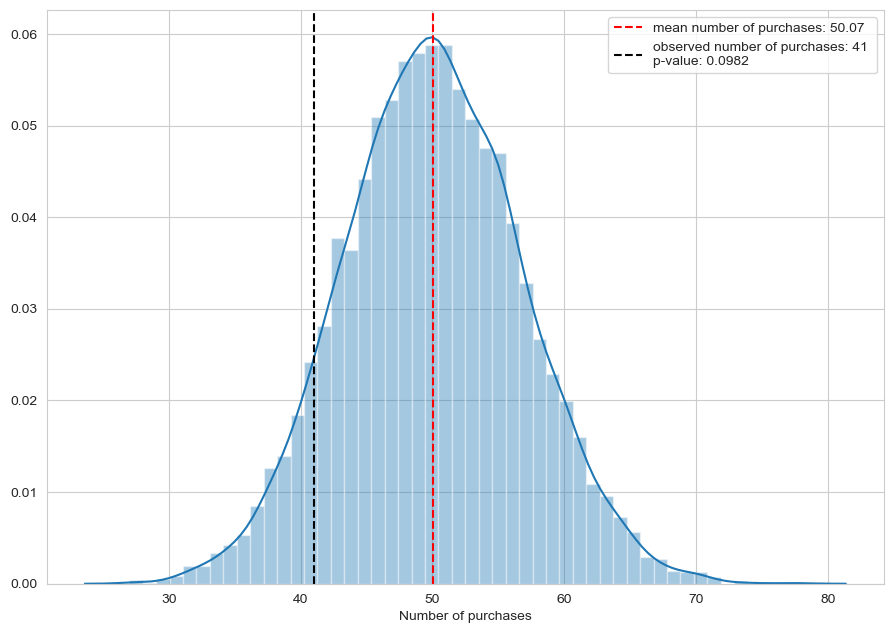
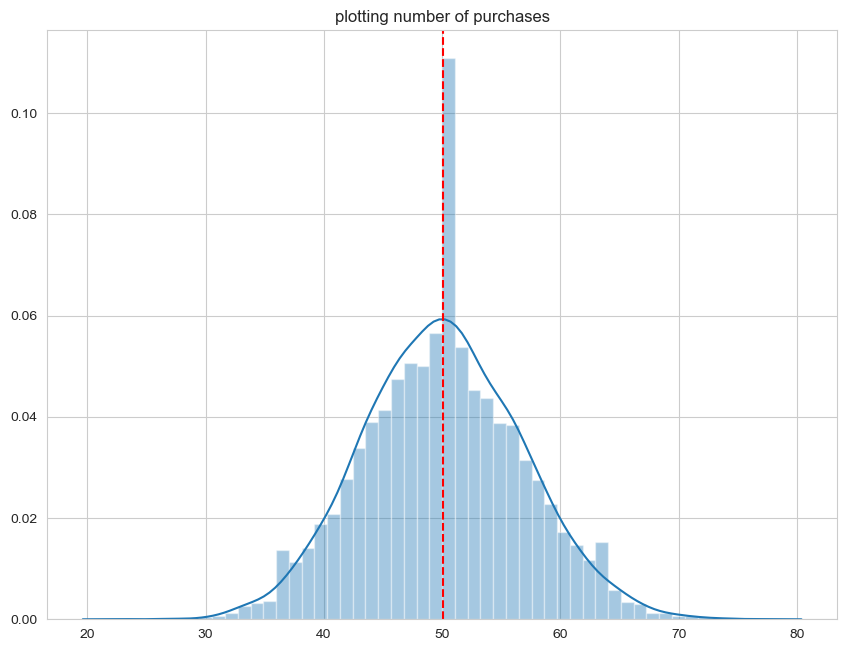
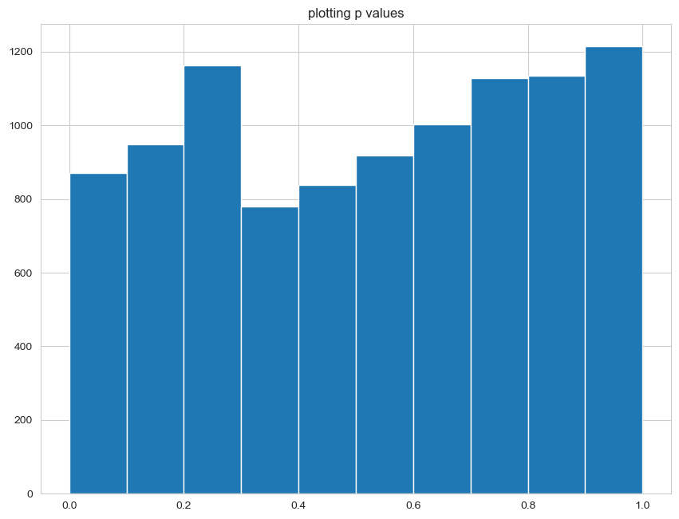

### **HYPOTHESIS TESTING**

**below is fictitious data of monthly sales at a shop**


```python
import pandas as pd
import numpy as np
import matplotlib.pyplot as plt 
import seaborn as sns
import random
import scipy.stats as st
```


```python
monthly_report = pd.read_csv('monthly_report.csv')
```


```python
monthly_report
```


<pre>
<div>
<style scoped>
    .dataframe tbody tr th:only-of-type {
        vertical-align: middle;
    }

    .dataframe tbody tr th {
        vertical-align: top;
    }

    .dataframe thead th {
        text-align: right;
    }
</style>
<table border="1" class="dataframe">
  <thead>
    <tr style="text-align: right;">
      <th></th>
      <th>timestamp</th>
      <th>purchase</th>
      <th>item</th>
    </tr>
  </thead>
  <tbody>
    <tr>
      <th>0</th>
      <td>2020-01-17 17:23:06</td>
      <td>y</td>
      <td>cue cards - love actually</td>
    </tr>
    <tr>
      <th>1</th>
      <td>2020-01-25 17:09:39</td>
      <td>n</td>
      <td>NaN</td>
    </tr>
    <tr>
      <th>2</th>
      <td>2020-01-25 05:22:01</td>
      <td>n</td>
      <td>NaN</td>
    </tr>
    <tr>
      <th>3</th>
      <td>2020-01-18 04:33:40</td>
      <td>y</td>
      <td>t-rex - jurassic park</td>
    </tr>
    <tr>
      <th>4</th>
      <td>2020-01-24 17:24:52</td>
      <td>n</td>
      <td>NaN</td>
    </tr>
    <tr>
      <th>...</th>
      <td>...</td>
      <td>...</td>
      <td>...</td>
    </tr>
    <tr>
      <th>495</th>
      <td>2020-01-16 08:40:02</td>
      <td>n</td>
      <td>NaN</td>
    </tr>
    <tr>
      <th>496</th>
      <td>2020-01-09 21:11:19</td>
      <td>n</td>
      <td>NaN</td>
    </tr>
    <tr>
      <th>497</th>
      <td>2020-01-31 08:54:51</td>
      <td>n</td>
      <td>NaN</td>
    </tr>
    <tr>
      <th>498</th>
      <td>2020-01-21 19:35:03</td>
      <td>n</td>
      <td>NaN</td>
    </tr>
    <tr>
      <th>499</th>
      <td>2020-01-31 09:48:43</td>
      <td>n</td>
      <td>NaN</td>
    </tr>
  </tbody>
</table>
<p>500 rows × 3 columns</p>
</div>
</pre>


```python
monthly_report.info()
```

    <class 'pandas.core.frame.DataFrame'>
    RangeIndex: 500 entries, 0 to 499
    Data columns (total 3 columns):
     #   Column     Non-Null Count  Dtype 
    ---  ------     --------------  ----- 
     0   timestamp  500 non-null    object
     1   purchase   500 non-null    object
     2   item       41 non-null     object
    dtypes: object(3)
    memory usage: 11.8+ KB


```python
monthly_report.purchase.replace({'y':1, 'n':0}, inplace=True)    
```

**Let us assume 10% is the expected percentage of purchases obeserved from historical data.**

**and what we observe from a months' sales data is..**


```python
monthly_report.mean()
```


    purchase    0.082
    dtype: float64


**what we are interested in knowing is whether this 8.2% purchase rate can be owed to mere chance.**

**i.e. is our observation of purchase rate = 8.2% 'statistically different' from historically observed purchase rate of 10%.**

<br>

**DETOUR: coin flipping experiment**

The experiment of flipping of a non-biased coin is always a good place to start when explaining binomial distribution. 

Event: Number of heads that one gets upon flipping the coin 100 times. The number of heads comes around 50 (but not exactly 50).


```python
flips = np.random.choice(['heads','tails'], size = 100, p = [0.5,0.5])
nof_heads = np.sum(flips == 'heads')
print(nof_heads)
```

    46


so what we are interested in knowing is if we get values that are not excatly 50, can we really owe it to imperfection of sampling (sampling error). Say if we get head 70 times, can it be due to sampling error or not?

Now lets repeat the 'coin flip exercise' 10000 times and track the number of heads that we get. Each 'coin flip exercise' consists of 100 flips.

**simulating the binomial distribution**


```python
flip_results = []

for i in range(10000): #repeating the experiment many number of times
    flips = np.random.choice(['heads','tails'], size = 100, p = [0.5,0.5])
    nof_heads = np.sum(flips == 'heads')
    flip_results.append(nof_heads)
    
plt.figure(figsize=(10.8,7.6), dpi=100)
sns.distplot(flip_results)
plt.axvline(np.mean(flip_results), color='red', label = f'mean: {np.mean(flip_results).round(2)}' )
plt.title('Binomial distribution')
plt.xlabel("Number of heads")
plt.legend()
plt.show()

# this is a discrete probability distribution. otherwise central limit theorem would apply here.
# as sample size gets larger, the standard error gets narrower...
```



**Note that the mean number of heads from each of the 10000 trials is close to the expected number, 50.**

<br>

**NOW, back to our question. lets imagine 10% percentage to be the expected percentage of purchases (from historical data). What we want to know here is: whether the number of purchases that we see here in our data (41 out of 500, 8.2%) is significantly different from 10%.**

**i.e. can we owe the 8.2% purchases to sampling error or not**

```python
# simulating an experiment with 500 visitors

simulated_visitors = np.random.choice([1,0], 500, p= [0.1, 0.9]) 
#simulating an experiment, where the visitor will 
#buy with probability of 10% and not buy with probability of 90%

nof_purchases = np.sum(simulated_visitors) 
print(nof_purchases)
```

    56


$$H_{0}$$ : the purchase rate is 10%

$$H_{1}$$ : the purchase rate is less that 10% 

**we find the chances of getting nof_purchases = 41, while the true purchase rate is 10%.**

if the chance of getting 41 is high enough while the true purchase rate is 10%, then we can owe the event of getting 41 to sampling error, and not reject the $$H_{0}$$. 


```python
#null hypothesis: probability of a purchase is 10%
#alternative hypothesis: purchase rate is below 10%

null_purchases = []
nof_41purchases = 0

# we simulate the vistors experiment 10000 times and note the number of times purchases made is less than 41. 

for i in range(10000):
    simulated_visitors = np.random.choice([1,0], 500, p= [0.1, 0.9]) 
    nof_purchases = np.sum(simulated_visitors)
    null_purchases.append(nof_purchases)
    if nof_purchases <=41:
        nof_41purchases+=1
    
# plotting the number of purchases made from our experiment. 
sns.set_style('whitegrid')
plt.figure(figsize=(10.8,7.6), dpi=100)
sns.distplot(null_purchases)
plt.axvline(np.mean(null_purchases), color='red',   linestyle = 'dashed',\
            label = f'mean number of purchases: {np.mean(null_purchases).round(2)}' )
plt.axvline(41, color='black', linestyle = 'dashed', \
            label = f'observed number of purchases: 41 \np-value: {nof_41purchases/10000}' )

# p_value is the probability of getting 41 or less number of successes in an experiment 
# where the probability of success is 10%

plt.xlabel("Number of purchases")
plt.legend()
plt.show()
```




using the **binomial test function in scipy.**

this will give the p value of observing the specified number of successes in 'n' trials, when it is repeated infintely. the results we got from our 'simulated test' is pretty close

```python
st.binom_test(x= 41, n= 500, p=0.1, alternative='less')
```


    0.1001135269756488

<br>

|    **Null hypothesis:** | **is true**  | **is false**  |
|-------------------------|--------------|---------------|
| P-value below threshold | Type I Error | Correct!      |
| P-value above threshold | Correct!     | Type II error |

<br>

**we see that the p-value we get is higher than any standard significant levels. so we do not reject the null hypothesis**

----

**LEVEL OF SIGNIFICANCE AND TYPE ONE ERROR RATE**

**(for the rest of the section, we no longer consider the observed purchase rate of 8.2%)**

**using built in functions in scipy, lets a sales data with probability of purchase = 10%**


```python
# simulating the random choice of size 500 when probability of purchasing is 0.1
# and probability of not purchasing is 0.9
simulation = np.random.choice(['y','n'], size = 500, p=[0.1,0.9])
purchases = np.sum(simulation == 'y')
print(simulation)
print(f"\n\nnumber of purchases: {purchases}")
```

    ['n' 'n' 'n' 'n' 'n' 'n' 'n' 'n' 'n' 'n' 'n' 'n' 'n' 'y' 'y' 'y' 'n' 'n'
     'n' 'y' 'n' 'n' 'n' 'n' 'n' 'n' 'n' 'n' 'y' 'n' 'n' 'n' 'n' 'y' 'y' 'n'
     'n' 'n' 'n' 'n' 'n' 'n' 'n' 'n' 'y' 'n' 'n' 'n' 'y' 'n' 'n' 'n' 'n' 'n'
     'n' 'n' 'n' 'n' 'n' 'y' 'n' 'n' 'n' 'n' 'n' 'n' 'n' 'n' 'n' 'y' 'n' 'n'
     'n' 'y' 'n' 'n' 'n' 'n' 'n' 'n' 'n' 'n' 'n' 'n' 'n' 'n' 'n' 'n' 'n' 'n'
     'n' 'y' 'n' 'n' 'y' 'n' 'n' 'n' 'y' 'n' 'n' 'n' 'y' 'n' 'n' 'y' 'y' 'n'
     'n' 'y' 'n' 'y' 'n' 'n' 'n' 'n' 'n' 'n' 'n' 'n' 'n' 'n' 'n' 'n' 'n' 'n'
     'n' 'n' 'n' 'n' 'n' 'n' 'n' 'n' 'n' 'n' 'n' 'n' 'n' 'n' 'n' 'y' 'n' 'n'
     'n' 'n' 'n' 'n' 'n' 'y' 'n' 'n' 'n' 'n' 'n' 'n' 'n' 'n' 'n' 'y' 'n' 'n'
     'n' 'n' 'n' 'n' 'n' 'n' 'n' 'n' 'n' 'n' 'n' 'n' 'n' 'n' 'n' 'n' 'n' 'n'
     'n' 'n' 'n' 'n' 'n' 'n' 'n' 'n' 'n' 'n' 'n' 'n' 'n' 'n' 'n' 'n' 'n' 'n'
     'y' 'n' 'n' 'n' 'n' 'n' 'n' 'n' 'n' 'n' 'y' 'n' 'n' 'n' 'y' 'n' 'n' 'n'
     'n' 'n' 'n' 'n' 'n' 'n' 'n' 'n' 'y' 'n' 'n' 'n' 'n' 'n' 'n' 'n' 'n' 'n'
     'n' 'n' 'n' 'n' 'n' 'n' 'n' 'y' 'n' 'n' 'n' 'n' 'n' 'n' 'n' 'n' 'y' 'n'
     'n' 'n' 'y' 'n' 'n' 'n' 'n' 'n' 'n' 'n' 'n' 'n' 'n' 'y' 'n' 'n' 'n' 'n'
     'n' 'n' 'n' 'n' 'n' 'n' 'n' 'n' 'n' 'y' 'n' 'n' 'n' 'n' 'n' 'n' 'n' 'n'
     'n' 'n' 'y' 'n' 'n' 'n' 'n' 'n' 'n' 'n' 'n' 'n' 'n' 'n' 'y' 'n' 'n' 'n'
     'n' 'n' 'n' 'n' 'n' 'n' 'n' 'n' 'n' 'n' 'n' 'n' 'n' 'n' 'n' 'n' 'n' 'n'
     'n' 'n' 'n' 'n' 'y' 'n' 'n' 'n' 'n' 'n' 'n' 'y' 'n' 'n' 'y' 'n' 'n' 'n'
     'n' 'n' 'n' 'n' 'n' 'n' 'n' 'n' 'n' 'n' 'n' 'n' 'n' 'n' 'n' 'n' 'n' 'n'
     'n' 'n' 'n' 'y' 'n' 'n' 'n' 'n' 'y' 'n' 'n' 'n' 'y' 'n' 'n' 'n' 'n' 'n'
     'n' 'n' 'n' 'n' 'n' 'n' 'n' 'n' 'n' 'n' 'n' 'n' 'n' 'n' 'n' 'n' 'n' 'n'
     'y' 'n' 'n' 'n' 'n' 'n' 'n' 'n' 'n' 'y' 'n' 'n' 'n' 'n' 'n' 'n' 'n' 'n'
     'n' 'n' 'n' 'n' 'n' 'n' 'n' 'n' 'n' 'y' 'n' 'n' 'n' 'n' 'n' 'n' 'n' 'y'
     'n' 'n' 'n' 'n' 'n' 'y' 'n' 'n' 'n' 'n' 'n' 'y' 'n' 'n' 'n' 'n' 'n' 'n'
     'n' 'n' 'y' 'n' 'n' 'n' 'n' 'n' 'n' 'n' 'n' 'n' 'n' 'n' 'n' 'n' 'n' 'n'
     'y' 'n' 'n' 'n' 'n' 'n' 'n' 'n' 'n' 'n' 'y' 'n' 'n' 'n' 'n' 'n' 'y' 'n'
     'n' 'n' 'n' 'n' 'n' 'n' 'n' 'n' 'n' 'n' 'n' 'n' 'n' 'n']
    
    
    number of purchases: 50


now we can use the scipy function to calculate the p value of observing the number of purchases from above, assuming the null hypotheses is true


```python
p_value = st.binom_test(purchases, n=500, p=0.1, alternative='less')
print(f"p value: {p_value.round(3)}") 
```

    p value: 0.538


```python
print(f"there is a {p_value.round(3)*100}% chance of observing {purchases} or fewer puchases given that the purchase rate is 10%.")
```

    there is a 53.80% chance of observing 50 or fewer puchases given that the purchase rate is 10%.


**repeating the experiment number of times and recording the p-values of each experiment**


```python
purchases_list = []
p_vals = []
```

<a id=1></a>


```python
for i in range(10000):
    # this random simulation is set to throw up 'y' with a probability of 10% 
    # (it wont be 10% all the time, but on an average, it will be)
    simulation = np.random.choice(['y','n'], size = 500, p=[0.1,0.9])
    purchases = np.sum(simulation == 'y')
    purchases_list.append(purchases)
    
    # probability of observing the particular number of "y's" in an experiment simulated under
    # the probability of observing it 10% of times, under a null hypothesis that the probability 
    # of observing "y's" is 10%.
    p_value = st.binom_test(purchases, 500, p=0.1)
    p_vals.append(p_value)
    

plt.figure(figsize=(10.2,7.8), dpi=100)
sns.distplot(purchases_list)
plt.axvline(np.mean(purchases_list), color='red', linestyle = 'dashed')
plt.title("plotting number of purchases")
plt.show()

plt.figure(figsize=(10.2,7.8), dpi=100)
plt.hist(p_vals)
plt.title("plotting p values")
plt.show()
```







If null hypothesis is true we could get any p values. The p-values should ideally follow a uniform distribution, i.e. any p-value between 0 and 1 should be equally likely. 

It follows a uniform distribution because these are probabilities that outcomes generated from an experiment with success rate of 10%, will be different from 10% success rate.

(*I found this part difficult to grasp, hence i have tried to explain it multiple times, in an attempt to understand*)

More clearly

* we simulate a sample where the true probability of purchase rate is 0.1
* then we run a binomial test where the null hypothesis is that the purchase rate in 0.1. (which is true here by construction)
* the resulting p-value could be anything between 0 to 1. 

However here the graph is spiky because our distribution of p-values from of 10000 samples of outcomes limited to values between 0 and 500 is technically not a continous distribution. With larger sample sizes the distribution will approach a uniform distribution.      

**TYPE 1 ERROR**

**Basically a tolerance level. The particular percentage of experiements we allow ourselves to reject the null even when its true**


```python
# rate of making type 1 errors.... how many of the 10000 types resulted in type one error

type_1_errors = 0

for i in range(10000):
    simulation = np.random.choice(['y','n'], size = 500, p=[0.1,0.9])
    purchases = np.sum(simulation == 'y')
    p_value = st.binom_test(purchases, 500, p=0.1)
    if p_value < 0.05: # here 0.05 is the significance level. 
        type_1_errors += 1
        
print(type_1_errors/10000)   
```

    0.0452


**type one error is 'quite close' to the significance level that we set. On repeating the experiment infinite number of times, the type one error rate and significance level becomes equal. This follows from the uniform distribution [shown above](#1).**

**the p_values we plotted should ideally be unifromly distributed, if that is the case, any p-value between 0 and 1 are equally likely and therefore the probability of observing the p values below (say) 5 % is equal to the 5 % of the area under the unifrom distribution.**

**the take away is that if the significance level is say 0.05, it means 5% of the times we are going to wrongly reject the null hypothesis. That means 5% of the experiments conducted will give wrong results. We can never escape the probability of gettting wrong results, even if we choose a very small threshold.** 

**only thing that can prevent costly mistakes is clear communication of all the results and the level of significance at which the alternate was accepted.**


```python

```
