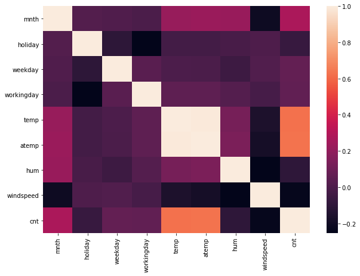
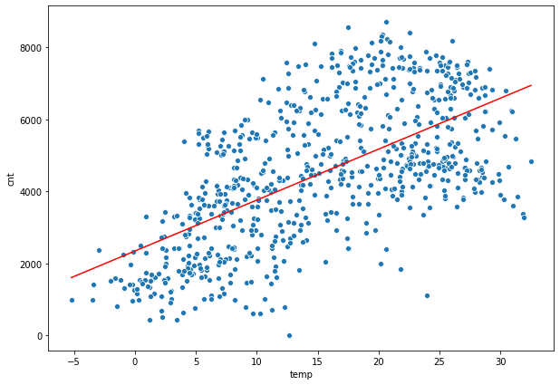
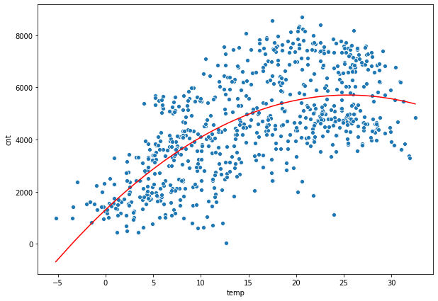
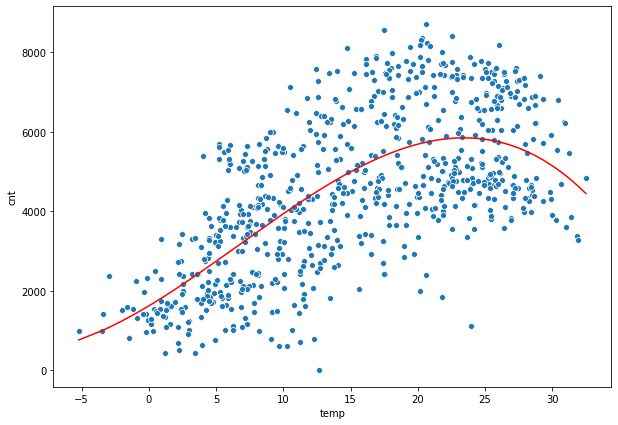
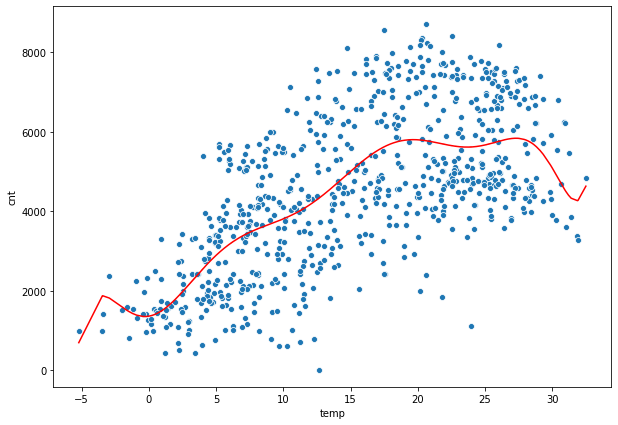

### **Choosing a Linear Regression Model**


source of data: <a href="https://archive.ics.uci.edu/ml/datasets/Bike+Sharing+Dataset" target="blank" rel="noopener noreferrer">archive.ics.uci.edu/ml/datasets/Bike+Sharing+Dataset</a>

**Task: Prediction of bike rental count daily based on the environmental and seasonal settings.**

**the variables**

- instant: record index
- dteday : date
- season : season (1:winter, 2:spring, 3:summer, 4:fall)
- yr : year (0: 2011, 1:2012)
- mnth : month ( 1 to 12)
- hr : hour (0 to 23)
- holiday : weather day is holiday or not (extracted from [Web Link])
- weekday : day of the week
- workingday : if day is neither weekend nor holiday is 1, otherwise is 0.
+ weathersit :
- 1: Clear, Few clouds, Partly cloudy, Partly cloudy
- 2: Mist + Cloudy, Mist + Broken clouds, Mist + Few clouds, Mist
- 3: Light Snow, Light Rain + Thunderstorm + Scattered clouds, Light Rain + Scattered clouds
- 4: Heavy Rain + Ice Pallets + Thunderstorm + Mist, Snow + Fog
- temp : Normalized temperature in Celsius. The values are derived via (t-t_min)/(t_max-t_min), t_min=-8, t_max=+39 (only in hourly scale)
- atemp: Normalized feeling temperature in Celsius. The values are derived via (t-t_min)/(t_max-t_min), t_min=-16, t_max=+50 (only in hourly scale)
- hum: Normalized humidity. The values are divided to 100 (max)
- windspeed: Normalized wind speed. The values are divided to 67 (max)
- casual: count of casual users
- registered: count of registered users


- ***cnt: count of total rental bikes including both casual and registered (the dependent variable)*** 


```python
import pandas as pd
import numpy as np
```


```python
import statsmodels.api as sm
```


```python
import matplotlib.pyplot as plt
import seaborn as sns
```


```python
#bike sharing counts aggregated on daily basis. Records: 731 days
bikes = pd.read_csv('bikes.csv')
```


```python
bikes
```


<pre>
<div>
<style scoped>
    .dataframe tbody tr th:only-of-type {
        vertical-align: middle;
    }

    .dataframe tbody tr th {
        vertical-align: top;
    }

    .dataframe thead th {
        text-align: right;
    }
</style>
<table border="1" class="dataframe">
  <thead>
    <tr style="text-align: right;">
      <th></th>
      <th>season</th>
      <th>mnth</th>
      <th>holiday</th>
      <th>weekday</th>
      <th>workingday</th>
      <th>weathersit</th>
      <th>temp</th>
      <th>atemp</th>
      <th>hum</th>
      <th>windspeed</th>
      <th>cnt</th>
    </tr>
  </thead>
  <tbody>
    <tr>
      <th>0</th>
      <td>winter</td>
      <td>1</td>
      <td>0</td>
      <td>6</td>
      <td>0</td>
      <td>mist</td>
      <td>8.175849</td>
      <td>7.999250</td>
      <td>80.5833</td>
      <td>10.749882</td>
      <td>985</td>
    </tr>
    <tr>
      <th>1</th>
      <td>winter</td>
      <td>1</td>
      <td>0</td>
      <td>0</td>
      <td>0</td>
      <td>mist</td>
      <td>9.083466</td>
      <td>7.346774</td>
      <td>69.6087</td>
      <td>16.652113</td>
      <td>801</td>
    </tr>
    <tr>
      <th>2</th>
      <td>winter</td>
      <td>1</td>
      <td>0</td>
      <td>1</td>
      <td>1</td>
      <td>clear</td>
      <td>1.229108</td>
      <td>-3.499270</td>
      <td>43.7273</td>
      <td>16.636703</td>
      <td>1349</td>
    </tr>
    <tr>
      <th>3</th>
      <td>winter</td>
      <td>1</td>
      <td>0</td>
      <td>2</td>
      <td>1</td>
      <td>clear</td>
      <td>1.400000</td>
      <td>-1.999948</td>
      <td>59.0435</td>
      <td>10.739832</td>
      <td>1562</td>
    </tr>
    <tr>
      <th>4</th>
      <td>winter</td>
      <td>1</td>
      <td>0</td>
      <td>3</td>
      <td>1</td>
      <td>clear</td>
      <td>2.666979</td>
      <td>-0.868180</td>
      <td>43.6957</td>
      <td>12.522300</td>
      <td>1600</td>
    </tr>
    <tr>
      <th>...</th>
      <td>...</td>
      <td>...</td>
      <td>...</td>
      <td>...</td>
      <td>...</td>
      <td>...</td>
      <td>...</td>
      <td>...</td>
      <td>...</td>
      <td>...</td>
      <td>...</td>
    </tr>
    <tr>
      <th>726</th>
      <td>winter</td>
      <td>12</td>
      <td>0</td>
      <td>4</td>
      <td>1</td>
      <td>mist</td>
      <td>3.945849</td>
      <td>-1.041628</td>
      <td>65.2917</td>
      <td>23.458911</td>
      <td>2114</td>
    </tr>
    <tr>
      <th>727</th>
      <td>winter</td>
      <td>12</td>
      <td>0</td>
      <td>5</td>
      <td>1</td>
      <td>mist</td>
      <td>3.906651</td>
      <td>0.833036</td>
      <td>59.0000</td>
      <td>10.416557</td>
      <td>3095</td>
    </tr>
    <tr>
      <th>728</th>
      <td>winter</td>
      <td>12</td>
      <td>0</td>
      <td>6</td>
      <td>0</td>
      <td>mist</td>
      <td>3.906651</td>
      <td>-0.001600</td>
      <td>75.2917</td>
      <td>8.333661</td>
      <td>1341</td>
    </tr>
    <tr>
      <th>729</th>
      <td>winter</td>
      <td>12</td>
      <td>0</td>
      <td>0</td>
      <td>0</td>
      <td>clear</td>
      <td>4.024151</td>
      <td>-0.707800</td>
      <td>48.3333</td>
      <td>23.500518</td>
      <td>1796</td>
    </tr>
    <tr>
      <th>730</th>
      <td>winter</td>
      <td>12</td>
      <td>0</td>
      <td>1</td>
      <td>1</td>
      <td>mist</td>
      <td>2.144151</td>
      <td>-1.249858</td>
      <td>57.7500</td>
      <td>10.374682</td>
      <td>2729</td>
    </tr>
  </tbody>
</table>
<p>731 rows × 11 columns</p>
</div>
</pre>


```python
bikes.info()
```

    <class 'pandas.core.frame.DataFrame'>
    RangeIndex: 731 entries, 0 to 730
    Data columns (total 11 columns):
     #   Column      Non-Null Count  Dtype  
    ---  ------      --------------  -----  
     0   season      731 non-null    object 
     1   mnth        731 non-null    int64  
     2   holiday     731 non-null    int64  
     3   weekday     731 non-null    int64  
     4   workingday  731 non-null    int64  
     5   weathersit  731 non-null    object 
     6   temp        731 non-null    float64
     7   atemp       731 non-null    float64
     8   hum         731 non-null    float64
     9   windspeed   731 non-null    float64
     10  cnt         731 non-null    int64  
    dtypes: float64(4), int64(5), object(2)
    memory usage: 62.9+ KB


**here, two different models are defined, right off the bat**


```python
model1 = sm.OLS.from_formula("cnt ~ temp + windspeed + holiday", data=bikes).fit()
```


```python
model2 = sm.OLS.from_formula("cnt ~ hum + season + weekday", data=bikes).fit()
```


```python
print(model1.summary())
```

                                OLS Regression Results                            
    ==============================================================================
    Dep. Variable:                    cnt   R-squared:                       0.415
    Model:                            OLS   Adj. R-squared:                  0.413
    Method:                 Least Squares   F-statistic:                     172.0
    Date:                Mon, 05 Jul 2021   Prob (F-statistic):           3.04e-84
    Time:                        13:58:02   Log-Likelihood:                -6373.7
    No. Observations:                 731   AIC:                         1.276e+04
    Df Residuals:                     727   BIC:                         1.277e+04
    Df Model:                           3                                         
    Covariance Type:            nonrobust                                         
    ==============================================================================
                     coef    std err          t      P>|t|      [0.025      0.975]
    ------------------------------------------------------------------------------
    Intercept   3103.0300    189.498     16.375      0.000    2731.002    3475.058
    temp         136.0322      6.471     21.023      0.000     123.329     148.735
    windspeed    -51.7882     10.717     -4.832      0.000     -72.829     -30.748
    holiday     -582.0506    328.864     -1.770      0.077   -1227.688      63.586
    ==============================================================================
    Omnibus:                       25.234   Durbin-Watson:                   0.475
    Prob(Omnibus):                  0.000   Jarque-Bera (JB):               15.243
    Skew:                           0.201   Prob(JB):                     0.000490
    Kurtosis:                       2.419   Cond. No.                         127.
    ==============================================================================
    
    Warnings:
    [1] Standard Errors assume that the covariance matrix of the errors is correctly specified.


```python
print(model2.summary())
```

                                OLS Regression Results                            
    ==============================================================================
    Dep. Variable:                    cnt   R-squared:                       0.388
    Model:                            OLS   Adj. R-squared:                  0.384
    Method:                 Least Squares   F-statistic:                     92.06
    Date:                Mon, 05 Jul 2021   Prob (F-statistic):           5.20e-75
    Time:                        13:58:02   Log-Likelihood:                -6390.0
    No. Observations:                 731   AIC:                         1.279e+04
    Df Residuals:                     725   BIC:                         1.282e+04
    Df Model:                           5                                         
    Covariance Type:            nonrobust                                         
    ====================================================================================
                           coef    std err          t      P>|t|      [0.025      0.975]
    ------------------------------------------------------------------------------------
    Intercept         6361.3610    309.196     20.574      0.000    5754.335    6968.387
    season[T.spring]   150.9391    160.721      0.939      0.348    -164.596     466.474
    season[T.summer]   818.1243    159.634      5.125      0.000     504.724    1131.525
    season[T.winter] -2355.9432    164.192    -14.349      0.000   -2678.291   -2033.595
    hum                -26.8127      4.049     -6.623      0.000     -34.761     -18.864
    weekday             53.8786     28.108      1.917      0.056      -1.304     109.061
    ==============================================================================
    Omnibus:                        3.650   Durbin-Watson:                   0.412
    Prob(Omnibus):                  0.161   Jarque-Bera (JB):                3.580
    Skew:                           0.135   Prob(JB):                        0.167
    Kurtosis:                       2.790   Cond. No.                         386.
    ==============================================================================
    
    Warnings:
    [1] Standard Errors assume that the covariance matrix of the errors is correctly specified.


**How do we compare the models**

$$R^{2} = 1 - \frac{\text{residual sum of squares}}{\text{total sum of squares}}$$

Proportion of variation in the data that is explained by the model.


```python
model1.rsquared
```


    0.41508122190307006


```python
model2.rsquared
```


    0.3883324473437182


temp + windspeed + holiday predict the count of bikes rented better than hum + season + weekday. 

variables could be added/deleted to the models to see how $$R^{2}$$ varies 


```python
model1 = sm.OLS.from_formula('cnt ~ temp + windspeed + holiday + season + weekday + hum + temp:hum + np.power(temp, 2)',data=bikes).fit()
```


```python
model2 = sm.OLS.from_formula('cnt ~ temp + windspeed + holiday + season + weekday + hum',data=bikes).fit()
```


```python
model1.rsquared
```


    0.5914201117209601


```python
model2.rsquared
```


    0.5409836901050976


model1 contains all the variables in model2 and more. These models are called **nested models**. here model2 is nested in model1. 

Larger of the nested models will always have higher $$R^{2}$$ than the smaller one, as it explains atleast a bit more of variation with those additional variables/complexities

But a higher $$R^{2}$$ does not improve the model per say

**Exploring the differences between models in more detail, using only one explanatory variable for simplicity**


```python
plt.figure(figsize=(10,7))
sns.heatmap(bikes.corr())
plt.show()
```




```python
bikes.corr()['cnt']
```


    mnth          0.279977
    holiday      -0.068348
    weekday       0.067443
    workingday    0.061156
    temp          0.627494
    atemp         0.631066
    hum          -0.100659
    windspeed    -0.234545
    cnt           1.000000
    Name: cnt, dtype: float64


**from the correlations we can think of 'mnth' 'temp' 'windspeed' 'hum' as maybe good predictors of 'cnt'**

**exploring relationships with 'temp'**


```python
# exploring the relationship between temerature and count
model1 = sm.OLS.from_formula('cnt ~ temp', data=bikes).fit()

predicted_counts = model1.predict()

plt.figure(figsize=(10,7))
sns.scatterplot(y = 'cnt', x = 'temp', data=bikes)
sns.lineplot(y = predicted_counts, x = bikes['temp'], color='red')
plt.show()
```




Maybe, adding a square term of 'temp' fits the model better?


```python
model2 = sm.OLS.from_formula('cnt ~ temp + np.power(temp, 2)', data=bikes).fit()

predicted_counts = model2.predict()

plt.figure(figsize=(10,7))
sns.scatterplot(y = 'cnt', x = 'temp', data=bikes)
sns.lineplot(y = predicted_counts, x = bikes['temp'], color='red')
plt.show()
```



What if a cubed term is added along with the squared term to `temp`?


```python
model3 = sm.OLS.from_formula('cnt ~ temp +  np.power(temp, 2) + np.power(temp, 3)', data=bikes).fit()

predicted_counts = model3.predict()

plt.figure(figsize=(10,7))
sns.scatterplot(y = 'cnt', x = 'temp', data=bikes)
sns.lineplot(y = predicted_counts, x = bikes['temp'], color='red')
plt.show()
```




adding more complexities...

upto 5th power...


```python
model4 = sm.OLS.from_formula('cnt ~ temp +  np.power(temp, 2) + np.power(temp, 3) + np.power(temp, 4) + np.power(temp, 5)', data=bikes).fit()

predicted_counts = model4.predict()

plt.figure(figsize=(10,7))
sns.scatterplot(y = 'cnt', x = 'temp', data=bikes)
sns.lineplot(y = predicted_counts, x = bikes['temp'], color='red')
plt.show()
```


upto 10th power...


```python
model5 = sm.OLS.from_formula('cnt ~ temp +  np.power(temp, 2) + np.power(temp, 3) + np.power(temp, 4) + np.power(temp, 5) + np.power(temp, 6) + np.power(temp, 7) + np.power(temp, 8) + np.power(temp, 9) + np.power(temp, 10)', data=bikes).fit()

predicted_counts = model5.predict()

plt.figure(figsize=(10,7))
sns.scatterplot(y = 'cnt', x = 'temp', data=bikes)
sns.lineplot(y = predicted_counts, x = bikes['temp'], color='red')
plt.show()
```



```python
# this model is very flexible and responds to every localised anomalies. 
```

**This final model explains this data very well... but this is overfit. It is not useful for prediction purposes. i.e. this wont perform well an unseen data.**

**we can look at other measures also... llf, aic, bic**


```python
df_ = pd.DataFrame(columns=['r_sq','adj_r_sq','llf','aic','bic'])
```


```python
i = 1
for each in [model1, model2, model3, model4, model5]:
    df_.loc[f'model{i}'] = [each.rsquared, each.rsquared_adj, each.llf, each.aic, each.bic]
    i+=1
```


```python
df_
```


<pre>
<div>
<style scoped>
    .dataframe tbody tr th:only-of-type {
        vertical-align: middle;
    }

    .dataframe tbody tr th {
        vertical-align: top;
    }

    .dataframe thead th {
        text-align: right;
    }
</style>
<table border="1" class="dataframe">
  <thead>
    <tr style="text-align: right;">
      <th></th>
      <th>r_sq</th>
      <th>adj_r_sq</th>
      <th>llf</th>
      <th>aic</th>
      <th>bic</th>
    </tr>
  </thead>
  <tbody>
    <tr>
      <th>model1</th>
      <td>0.393749</td>
      <td>0.392917</td>
      <td>-6386.767848</td>
      <td>12777.535697</td>
      <td>12786.724524</td>
    </tr>
    <tr>
      <th>model2</th>
      <td>0.453179</td>
      <td>0.451677</td>
      <td>-6349.058090</td>
      <td>12704.116181</td>
      <td>12717.899421</td>
    </tr>
    <tr>
      <th>model3</th>
      <td>0.462653</td>
      <td>0.460435</td>
      <td>-6342.670356</td>
      <td>12693.340711</td>
      <td>12711.718365</td>
    </tr>
    <tr>
      <th>model4</th>
      <td>0.462845</td>
      <td>0.459140</td>
      <td>-6342.539783</td>
      <td>12697.079565</td>
      <td>12724.646046</td>
    </tr>
    <tr>
      <th>model5</th>
      <td>0.471186</td>
      <td>0.464585</td>
      <td>-6336.819234</td>
      <td>12693.638469</td>
      <td>12739.582604</td>
    </tr>
  </tbody>
</table>
</div>
</pre>


**adj_r_sq (adjusted r squared)** values penalises r squared values for added complexities

**llf (log likelihood)**  the likelihood that the model could have produced our observed y-values. higher the log likelihood, the better.


**aic and bic** both basically penalises the log-likelihood for each additional predictors. bic imposes higher penality than aic. lower these values, better they are.

Here we do not see much improvement in these measures from model 2 to model 5. Based on bic value, model 3 does a good job. 

And given that adding complexities has serious downsides such as overfitting, making it hard to explain the coefficients etc, we should think twice before adding complexities.

**using anova test to see if models are significantly different from each other**


```python
from statsmodels.stats.anova import anova_lm
anova_results = anova_lm(model1, model2)
```


```python
anova_results.round(2)
```


<pre>
<div>
<style scoped>
    .dataframe tbody tr th:only-of-type {
        vertical-align: middle;
    }

    .dataframe tbody tr th {
        vertical-align: top;
    }

    .dataframe thead th {
        text-align: right;
    }
</style>
<table border="1" class="dataframe">
  <thead>
    <tr style="text-align: right;">
      <th></th>
      <th>df_resid</th>
      <th>ssr</th>
      <th>df_diff</th>
      <th>ss_diff</th>
      <th>F</th>
      <th>Pr(&gt;F)</th>
    </tr>
  </thead>
  <tbody>
    <tr>
      <th>0</th>
      <td>729.0</td>
      <td>1.660847e+09</td>
      <td>0.0</td>
      <td>NaN</td>
      <td>NaN</td>
      <td>NaN</td>
    </tr>
    <tr>
      <th>1</th>
      <td>728.0</td>
      <td>1.498035e+09</td>
      <td>1.0</td>
      <td>162811394.1</td>
      <td>79.12</td>
      <td>0.0</td>
    </tr>
  </tbody>
</table>
</div>
</pre>


the anova results compares model 1 and model 2, the low p value tells us that models are siginificantly different.


```python
anova_results = anova_lm(model3, model4)
```


```python
anova_results.round(2)
```


<pre>
<div>
<style scoped>
    .dataframe tbody tr th:only-of-type {
        vertical-align: middle;
    }

    .dataframe tbody tr th {
        vertical-align: top;
    }

    .dataframe thead th {
        text-align: right;
    }
</style>
<table border="1" class="dataframe">
  <thead>
    <tr style="text-align: right;">
      <th></th>
      <th>df_resid</th>
      <th>ssr</th>
      <th>df_diff</th>
      <th>ss_diff</th>
      <th>F</th>
      <th>Pr(&gt;F)</th>
    </tr>
  </thead>
  <tbody>
    <tr>
      <th>0</th>
      <td>727.0</td>
      <td>1.472082e+09</td>
      <td>0.0</td>
      <td>NaN</td>
      <td>NaN</td>
      <td>NaN</td>
    </tr>
    <tr>
      <th>1</th>
      <td>725.0</td>
      <td>1.471556e+09</td>
      <td>2.0</td>
      <td>525800.08</td>
      <td>0.13</td>
      <td>0.88</td>
    </tr>
  </tbody>
</table>
</div>
</pre>


the above test compares model 3 and model 4, the high p value tells us that models are not siginificantly different. meaning we do not get much benefit from adding that complexity.


```python
# anova test for all the models
anova_results = anova_lm(model1, model2, model3, model4, model5)
anova_results.round(2)
```


<pre>
<div>
<style scoped>
    .dataframe tbody tr th:only-of-type {
        vertical-align: middle;
    }

    .dataframe tbody tr th {
        vertical-align: top;
    }

    .dataframe thead th {
        text-align: right;
    }
</style>
<table border="1" class="dataframe">
  <thead>
    <tr style="text-align: right;">
      <th></th>
      <th>df_resid</th>
      <th>ssr</th>
      <th>df_diff</th>
      <th>ss_diff</th>
      <th>F</th>
      <th>Pr(&gt;F)</th>
    </tr>
  </thead>
  <tbody>
    <tr>
      <th>0</th>
      <td>729.0</td>
      <td>1.660847e+09</td>
      <td>0.0</td>
      <td>NaN</td>
      <td>NaN</td>
      <td>NaN</td>
    </tr>
    <tr>
      <th>1</th>
      <td>728.0</td>
      <td>1.498035e+09</td>
      <td>1.0</td>
      <td>1.628114e+08</td>
      <td>81.03</td>
      <td>0.00</td>
    </tr>
    <tr>
      <th>2</th>
      <td>727.0</td>
      <td>1.472082e+09</td>
      <td>1.0</td>
      <td>2.595327e+07</td>
      <td>12.92</td>
      <td>0.00</td>
    </tr>
    <tr>
      <th>3</th>
      <td>725.0</td>
      <td>1.471556e+09</td>
      <td>2.0</td>
      <td>5.258001e+05</td>
      <td>0.13</td>
      <td>0.88</td>
    </tr>
    <tr>
      <th>4</th>
      <td>721.0</td>
      <td>1.448704e+09</td>
      <td>4.0</td>
      <td>2.285246e+07</td>
      <td>2.84</td>
      <td>0.02</td>
    </tr>
  </tbody>
</table>
</div>
</pre>


**based on these various statistics, one can judge which model (with what level of complexity) is optimum for the purpose**
